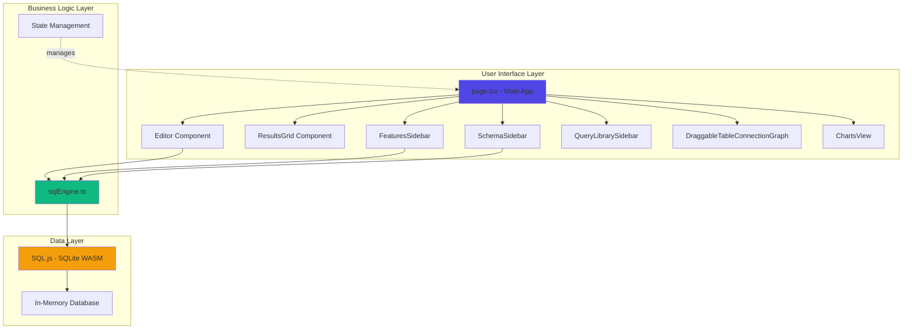
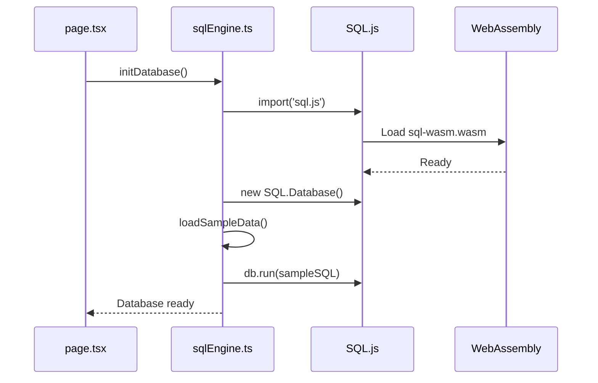
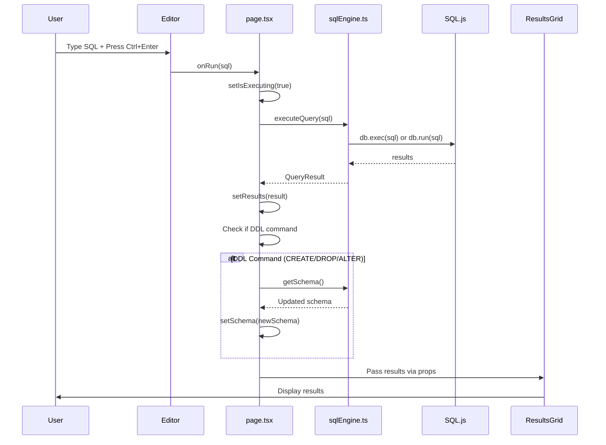
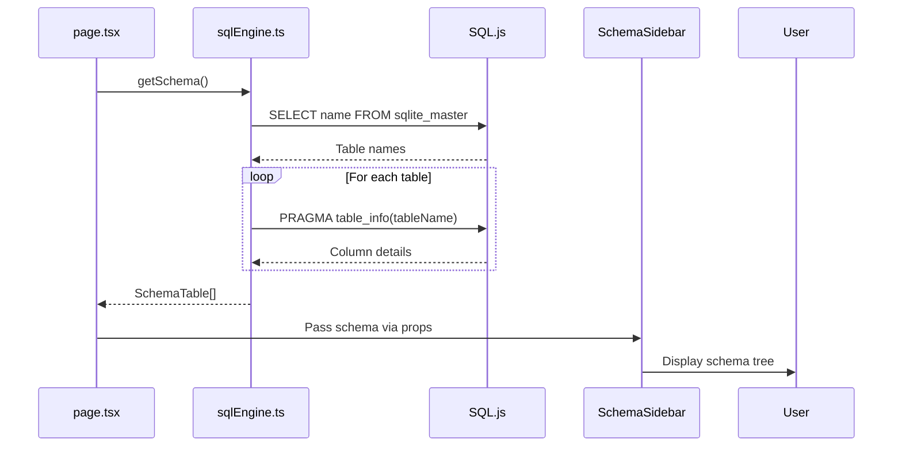

# QueryCraft Architecture

This document provides a comprehensive overview of QueryCraft's system architecture, design patterns, and component interactions.

## Table of Contents
- [System Overview](#system-overview)
- [Technology Stack](#technology-stack)
- [Architecture Diagram](#architecture-diagram)
- [Core Components](#core-components)
- [Data Flow](#data-flow)
- [Design Patterns](#design-patterns)
- [State Management](#state-management)

## System Overview

QueryCraft is a client-side SQL editor built with Next.js and React that runs entirely in the browser. It uses SQL.js (SQLite compiled to WebAssembly) to execute SQL queries without requiring a backend server.

### Key Architectural Decisions

1. **Client-Side Only**: All SQL execution happens in-browser using WebAssembly
2. **Component-Based**: Modular React components for maintainability
3. **Type-Safe**: Full TypeScript implementation for reliability
4. **Modern UI**: CSS variables + Tailwind for consistent theming
5. **No Backend Required**: Zero server-side dependencies for SQL operations

## Technology Stack

| Layer | Technology | Purpose |
|-------|-----------|---------|
| **Framework** | Next.js 15.5 (App Router) | React meta-framework, routing, SSR |
| **Language** | TypeScript 5.6 | Type safety, developer experience |
| **UI Library** | React 19.1 | Component-based UI |
| **Styling** | Tailwind CSS 3.4 + Custom CSS | Utility-first styling + theming |
| **Animation** | Framer Motion 12.23 | Smooth UI animations |
| **Code Editor** | Monaco Editor 4.6 | VS Code-powered editor |
| **Database** | SQL.js 1.13 | In-browser SQLite via WebAssembly |
| **Icons** | Lucide React | Icon library |

## Architecture Diagram



## Core Components

### 1. Main Application (`page.tsx`)

**Purpose**: Root component that orchestrates the entire application

**Responsibilities**:
- Initialize SQL.js database on mount
- Manage global state (tabs, results, schema, charts)
- Coordinate communication between child components
- Handle query execution and schema refresh

**Key State**:
```typescript
- tabs: Tab[]              // Query tab management
- activeTab: number        // Currently selected tab
- results: QueryResult     // Query execution results
- schema: SchemaTable[]    // Database schema
- chartData: ChartData     // Chart visualization data
- showConnections: boolean // Toggle ER diagram view
```

### 2. SQL Engine (`lib/sqlEngine.ts`)

**Purpose**: Abstraction layer over SQL.js for database operations

**Exported Functions**:
- `initDatabase()` - Initialize SQL.js and load sample data
- `executeQuery(sql)` - Execute SQL and return formatted results
- `getSchema()` - Retrieve current database schema
- `exportDatabase()` - Export database as binary
- `importDatabase(data)` - Import database from binary
- `clearDatabase()` - Drop all tables

**Database Initialization Flow**:


### 3. Editor Component (`Editor.tsx`)

**Purpose**: SQL code editor with Monaco

**Features**:
- Syntax highlighting for SQL
- Auto-completion
- Keyboard shortcuts (Ctrl+Enter to run)
- Drag-and-drop query support
- Line numbers and minimap

**Integration**:
```typescript
// Monaco is loaded dynamically (client-side only)
const MonacoEditor = dynamic(() => import("@monaco-editor/react"), { 
  ssr: false 
});
```

### 4. Results Grid (`ResultsGrid.tsx`)

**Purpose**: Display query results in tabular format

**Features**:
- Responsive table layout
- Null value handling
- Error display
- Execution time metrics
- Row count display

### 5. Schema Sidebar (`SchemaSidebar.tsx`)

**Purpose**: Browse and explore database schema

**Features**:
- Expandable/collapsible tables
- Column details (type, PK, NOT NULL)
- Drag-and-drop table/column names to editor
- Visual indicators for constraints

### 6. Features Sidebar (`FeaturesSidebar.tsx`)

**Purpose**: Advanced features (Visual Query Builder, Charts)

**Sections**:
- **Visual Query Builder**: Build SELECT queries interactively
- **Chart Generator**: Create visualizations from data

### 7. Query Library Sidebar (`QueryLibrarySidebar.tsx`)

**Purpose**: Pre-built query templates

**Categories**:
- Basic Queries
- Joins
- Aggregations
- Data Modification
- Schema Changes

### 8. Draggable Table Connection Graph (`DraggableTableConnectionGraph.tsx`)

**Purpose**: Interactive ER diagram

**Features**:
- Drag-and-drop table positioning
- Automatic foreign key detection
- SVG-based connection rendering
- Real-time position updates

**Connection Detection Algorithm**:
```typescript
// Detects FK relationships by convention (_id suffix)
if (columnName.endsWith("_id")) {
  const referencedTable = columnName.replace(/_id$/, "");
  // Check if referenced table exists
  if (tableExists(referencedTable)) {
    createConnection(currentTable, referencedTable);
  }
}
```

### 9. Charts View (`ChartsView.tsx`)

**Purpose**: Render data visualizations

**Chart Types**:
- Pie charts (distribution)
- Bar charts (comparison)
- Line charts (trends)

## Data Flow

### Query Execution Flow



### Schema Refresh Flow



## Design Patterns

### 1. **Container/Presenter Pattern**

`page.tsx` acts as a container component managing state, while child components are presenters focused on UI.

### 2. **Dependency Injection**

Components receive dependencies via props rather than importing directly:
```typescript
<Editor onRun={runQuery} isExecuting={isExecuting} />
```

### 3. **Facade Pattern**

`sqlEngine.ts` provides a simplified interface to SQL.js complexity.

### 4. **Dynamic Imports**

Monaco Editor is loaded client-side only:
```typescript
const MonacoEditor = dynamic(() => import("@monaco-editor/react"), { 
  ssr: false 
});
```

### 5. **Hook-Based State Management**

React hooks (`useState`, `useEffect`, `useRef`) manage component state.

## State Management

QueryCraft uses React's built-in state management:

### Global State (in `page.tsx`)

| State | Type | Purpose |
|-------|------|---------|
| `isInitialized` | boolean | Database ready flag |
| `tabs` | Tab[] | Query tabs |
| `activeTab` | number | Current tab |
| `results` | QueryResult \| null | Query results |
| `error` | string \| null | Error messages |
| `schema` | SchemaTable[] | Database schema |
| `isExecuting` | boolean | Query running flag |
| `chartData` | ChartData \| null | Chart config |
| `showConnections` | boolean | ER diagram toggle |

### Props Flow

```
page.tsx (state owner)
  ├─> Editor (onRun, isExecuting)
  ├─> ResultsGrid (data, error)
  ├─> SchemaSidebar (schema)
  ├─> FeaturesSidebar (schema, onShowChart)
  ├─> QueryLibrarySidebar (no props)
  ├─> DraggableTableConnectionGraph (schema)
  └─> ChartsView (chartData, onClose)
```

## Performance Considerations

### 1. **Code Splitting**
- Monaco Editor loaded dynamically
- SQL.js imported only when needed

### 2. **Memoization**
- Connection calculations memoized with `useMemo`
- Schema updates only on DDL commands

### 3. **WebAssembly**
- SQL.js runs at near-native speeds
- Database operations are synchronous (no network latency)

### 4. **Virtual DOM**
- React optimizes re-renders
- Framer Motion uses hardware-accelerated transforms

## Security Considerations

Since QueryCraft runs entirely client-side:

✅ **Safe**:
- No server-side SQL injection risk
- Data never leaves the browser
- No authentication needed

⚠️ **Limitations**:
- Database resets on page reload (no persistence)
- Not suitable for production data
- Educational/prototyping tool only

## Future Architecture Enhancements

1. **State Management**: Consider Zustand or Jotai for complex state
2. **Persistence**: IndexedDB integration for database persistence
3. **Web Workers**: Move SQL.js to worker thread for better performance
4. **Service Worker**: Offline support and caching
5. **Module Federation**: Plugin system for extensions

---

**Last Updated**: November 2025  
**Author**: Devansh Jani
